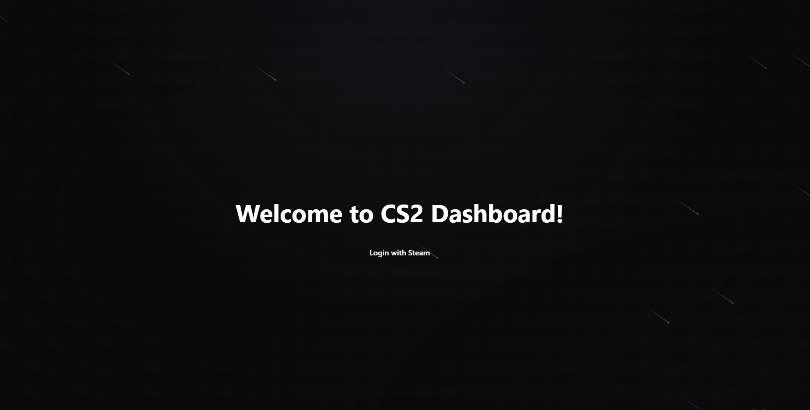

# Cs2-Player-Dashboard

## Overview
A full-stack web application for tracking and visualising Counter-Strike 2 player statistics in real time.
The system integrates directly with a CS2 server plugin to collect match data and present player insights through a web-based dashboard. The project focuses primarily on backend architecture and data processing, with a simple and functional frontend for visualisation.

## Demo > Tested using a development server.

This project demonstrates full-stack development, REST API design, authentication integration, and database management.

## Architecture:

- Frontend: React, Vite, TypeScript

- Backend: FastAPI (Python)

- Database: MySQL (SQLAlchemy + PyMySQL)

- Integration: CS2 server plugin (CounterStrikeSharp / C#)

- Authentication: Steam OpenID (login flow)

## Features

- Match stats ingestion (HTTP) from a CS2 server plugin

- Player authentication via Steam OpenID

- Player stat aggregation (kills, deaths, headshots, damage, objectives, rounds)

- Weapon breakdown stats per player

- Environment-based configuration (frontend/backend URLs, DB, keys)

- REST API with configurable CORS

## Technical Highlights:

- Relational schema for player + weapon snapshots

- Implemented RESTful endpoints using FastAPI

- Implemented CORS and Steam OpenID authentication flow

- Built a detailed dashboard UI using React + TypeScript

- Integrated third-party Steam authentication

## Deployment

### 1. CSSharp Plugin
- Download plugin build from Releases and drop into csgo folder
- Must have Metamod and CSSharp plugins installed which can be found here:
  - Metamod: https://www.sourcemm.net/downloads.php/?branch=master 
  - CSSharp: https://github.com/roflmuffin/CounterStrikeSharp
- Set Correct variables within the config file. This will ensure proper communication between c# plugin and backend
- To display the site's link in chat, fill the 'frontendUrl' varaible within config.

### 2. Database (MySQL) and CS
- Create a managed MySQL instance (e.g., Railway, PlanetScale, Render, or AWS RDS).
- Create a database for the project.
- Configure environment variables in the backend:
  - `DB_HOST`, `DB_PORT`, `DB_NAME`, `DB_USER`, `DB_PASSWORD`

> Currently, tables are created automatically via SQLAlchemy on startup.

### 3. Backend (FastAPI)
- Deploy the backend to a service such as Render, Railway, Fly.io, or a VPS.
- Set environment variables:
  - `BACKEND_URL` (public backend URL)
  - `FRONTEND_URL` (public frontend URL)
  - `CORS_ORIGINS`
  - `STEAM_API_KEY`
  - Database credentials

- Start command: uvicorn app.main:app --host 0.0.0.0 --port 8000

### 4. Frontend (React + Vite)
- Deploy to Vercel, Netlify, or similar static hosting.
- Set environment variables:
  - `VITE_BACKEND_BASE_URL` to the deployed backend URL.

- Build command: npm run build

### Steam Authentication Note
The backend callback URL must be publicly accessible (HTTPS).
Ensure `BACKEND_URL` matches the deployed backend domain.

## Development Plan 

- Improve deployment documentation
- Add Owner/Admin/user system
- Admin ticket feature
- Server performance/logs from admin/owner page
